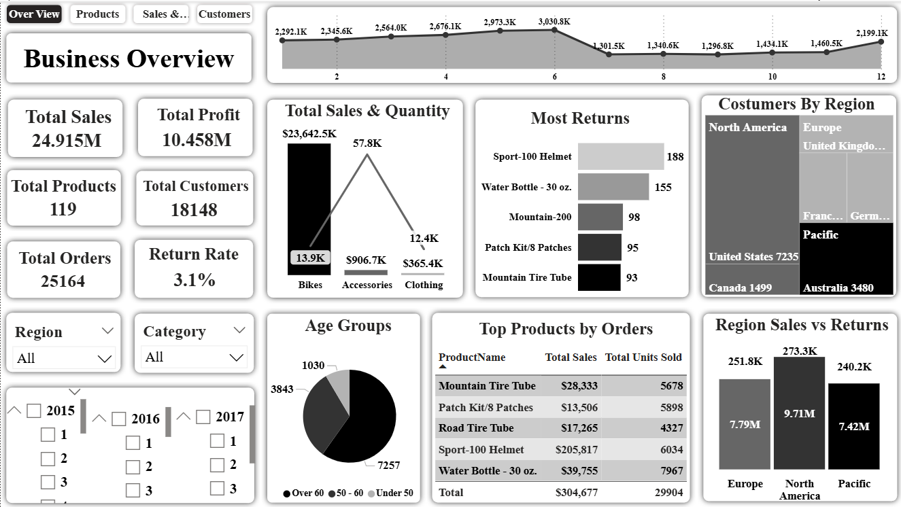

# Business Performance Analysis

## Project Objective

This project is a full business performance analysis for **Adventure Works**, a bike and accessories company. The analysis explores overall business performance across four main areas: business overview, product performance, sales & returns, and customer behavior.

The goal is to understand revenue trends, profitability, product performance, customer segmentation, and regional sales patterns. The project was built using SQL for data analysis and Power BI for creating interactive dashboards.

---

## Dataset Description

The dataset represents a retail business structure for Adventure Works and includes multiple related tables .
The data covers sales transactions, product catalog information, customer demographics, return records, and geographical regions. 
---

## Tools Used

* SQL for data extraction, joins, aggregations, and advanced analysis using CTEs and window functions
* Power BI for building interactive dashboards with KPIs, filters, and visual storytelling
* Power Query for data cleaning, transformation, and preprocessing

---

## Data Cleaning

### Power Query

* Standardized data types across all tables (dates, numbers, text)
* Handled missing and inconsistent values 
* Created calculated columns 

### SQL (Products Table – CProducts)

* Created a cleaned version of the product table to preserve original data
* Cleaned ProductSKU by removing unnecessary suffixes
* Replaced invalid values such as “NA”, “Multi”, and “0” with “Unknown”
* Standardized ProductColor, ProductSize, and ProductStyle values
* Rounded price and cost fields to improve consistency
* Cleaned ProductName by removing embedded color values and extra formatting
* Verified data integrity and checked for duplicate product keys

---

## Dashboard Overview

The project includes four interactive Power BI dashboards, each designed with Region, Category, and Time (Year/Quarter) filters.

### 1. Business Overview Dashboard

A high-level summary of overall business performance including revenue, profit, and key KPIs.

### 2. Products Dashboard

Focuses on product performance, category contribution, sales distribution, and return behavior.

### 3. Sales & Returns Dashboard

Analyzes revenue, costs, profitability, and return rates across regions and product categories.

### 4. Customers Dashboard

Explores customer segmentation based on demographics, behavior, geography, income, and purchasing patterns.

---

## Exploratory Data Analysis

### Products

* The catalog contains **119 products**, but only **40 have recorded sales**
* Many products (79) have never been sold, showing underutilized inventory
* Bikes dominate the business, generating the majority of revenue
* Accessories and Clothing contribute a much smaller share

Top-performing products include Mountain-200, Road-250, and Touring-1000. However, some products also show high return rates, which may impact profitability.

---

### Sales & Revenue

* Total Sales: **$24.9M**
* Total Profit: **$10.5M**
* Profit Margin: **42%**
* Total Orders: **25,164**
* Total Costs: **$14.5M**
* Net Sales after returns: **$24.15M**
* Return Rate: **3.1% ($765.3K)**

North America leads in sales performance, followed by Europe and the Pacific region. Revenue is highly concentrated in premium-priced products, which account for the majority of total sales.

---

### Customers

* Total Customers: **18,148**
* Active Customers: **17,416 (96%)**
* Repeat Rate: **33.63%**
* New Customers: **6,857**

Customer distribution is nearly balanced by gender. The United States is the largest market, followed by Australia and Canada.

The most common customer segment is older customers (60+), and most customers fall into middle-income ranges. Homeowners make up a larger share compared to renters.

---

## Key Insights

1. Bikes generate nearly all revenue, making the business heavily dependent on a single product category
2. A large portion of products (79 out of 119) have never been sold, indicating weak product utilization
3. Profit margin is strong at 42%, but returns on certain products may reduce overall profitability
4. North America is the strongest market, especially the United States
5. The customer base is dominated by older age groups (60+), shaping demand patterns
6. Only one-third of customers are repeat buyers, showing room for loyalty improvement
7. High-priced products drive most of the revenue, showing dependence on premium customers
8. Sales show noticeable seasonal fluctuations, with clear peaks and drops during the year

---

## Conclusion

This project provides a complete business intelligence analysis of Adventure Works using SQL and Power BI. It highlights key strengths such as strong bike sales, high profitability, and a dominant North American market.
